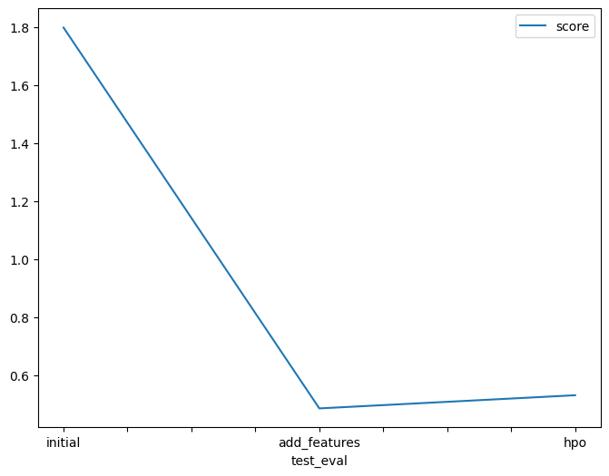

# Report: Predict Bike Sharing Demand with AutoGluon Solution
#### Swastik Gorai

## Initial Training
### What did you realize when you tried to submit your predictions? What changes were needed to the output of the predictor to submit your results?
When I first submitted my prediction to Kaggle, the score i got was aroung 1.8, which was way off than what the top performers were achieving. So, I thought that performing EDA and feature engineering would help me improve my score.

### What was the top ranked model that performed?
The top ranked model was 'WeightedEnsemble_L3' with RMSE score of -34.2031.

## Exploratory data analysis and feature creation
### What did the exploratory analysis find and how did you add additional features?
The exploritary analysis i did on the dataset found out the variables or features with high correlation and the trends in the varying patterns.

### How much better did your model preform after adding additional features and why do you think that is?
The model outperformed the previous model without EDA by a fairly large margin because after doing EDA, extra valuable features were added into the dadatset which captured the underlying details of the data

## Hyper parameter tuning
### How much better did your model preform after trying different hyper parameters?
Unfortunately, performing hyperparameter tuning did worse than the EDA one, most prbably because of the incorrect hypermeters I used or the hyperparameters were not so accurate.

### If you were given more time with this dataset, where do you think you would spend more time?
If I were given more time with this dataset, I would spend more time on hyperparameter tuning(mostly) and feature engineering. I am sure that if the model with simple eda performed so well, then with proper hyperparameter tuning would result in even better result. My most of the time went in debugging the ocde as the documentation was changed in variuos places and hence i did not go in depth in the documentation for hyperparameters

### Create a table with the models you ran, the hyperparameters modified, and the kaggle score.
|model|hpo1|hpo2|hpo3|score|
|--|--|--|--|--|
|initial|as mentioned|as mentioned|present:high quality|1.79942|
|add_features|as mentioned|as mentioned||0.48708|
|hpo|NN, GBM|XGB|RF, XT|0.53243|

### Create a line plot showing the top model score for the three (or more) training runs during the project.

### Create a line plot showing the top kaggle score for the three (or more) prediction submissions during the project.

## Summary
The provided dataset was used, first without EDA which yielded a poor result. Then EDA was performend on the dataset, adding new features and removing high corelated
variables/features using the corelartion matrix. Next up, hyperparameter tuning was performed which supposidely should have improved the score but in my case, it did n ot most probably due to poor choices of hyperparameter values. Even then, I will go through the documentation and try to improve the score. Overall, thos project was a great learning experience!